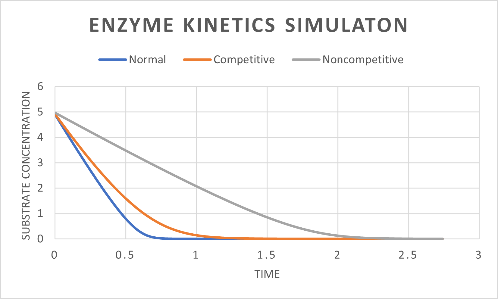
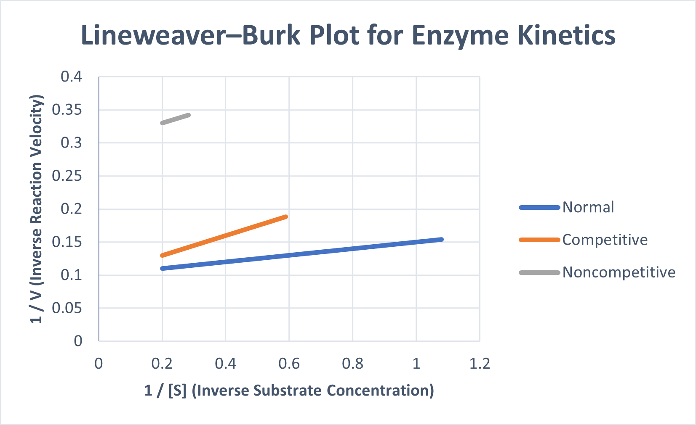

# Enzyme Kinetics Simulator (C++)

A biochemical simulation engine written in C++ that models enzyme-catalyzed reactions using Michaelis-Menten kinetics.

## Features

- Object-Oriented Design
- Numerical simulation of substrate depletion
- Time-based enzyme reaction modeling
- Competitive inhibition support
- File input/output system
- Dynamic velocity tracking
- Conversion analysis

## Scientific Model

The simulator uses Michaelis-Menten enzyme kinetics:

v = (Vmax * [S]) / (Km + [S])

Where:
- Vmax = maximum reaction velocity
- Km = Michaelis constant
- [S] = substrate concentration

## Technologies Used

- C++
- OOP
- File Handling
- Numerical Simulation
- Scientific Computing

## Run Instructions

Compile:

g++ src/*.cpp -o simulator

Run:

./simulator

## Output

The program generates:
- substrate concentration history
- reaction velocity history
- conversion percentages over time

  # Enzyme Kinetics Simulator

## Combined Kinetics Plot

## Lineweaver-Burk Plot

## Future Improvements

- Non-competitive inhibition
- Multi-enzyme pathways
- Graph plotting
- Parameter fitting
- GUI support
